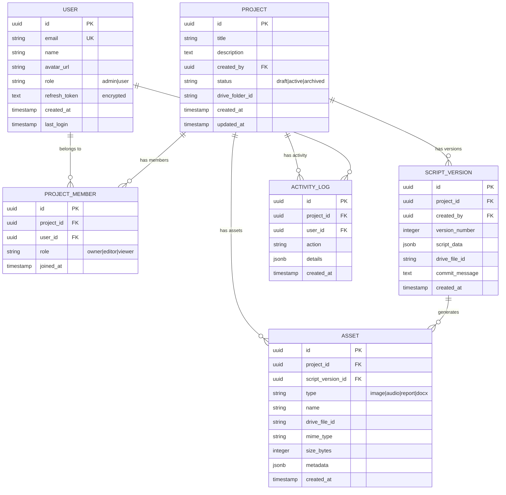

# System Design: Database & Persistence Layer

## Overview

This document defines the database architecture for the Slide Generator application, enabling user workspaces, project management, collaboration, versioning, and audit trails.

---

## Requirements Summary

| Requirement | Description |
|-------------|-------------|
| **Multi-project** | Users can create and manage multiple projects |
| **Versioning** | Track script versions (v1, v2, v3...) |
| **Collaboration** | Multiple users can work on the same project |
| **RBAC** | Role-based access (admin, author, reviewer) |
| **Audit Trail** | Track who did what, when |
| **File Storage** | Google Drive (user's own account) |
| **Auth** | Google OAuth (Workspace Internal, @edupyramids.org) |

---

## Entity-Relationship Diagram



---

## Table Schemas

### 1. Users

```sql
CREATE TABLE users (
    id UUID PRIMARY KEY DEFAULT gen_random_uuid(),
    email VARCHAR(255) UNIQUE NOT NULL,
    name VARCHAR(255) NOT NULL,
    avatar_url TEXT,
    role VARCHAR(50) DEFAULT 'user' CHECK (role IN ('admin', 'user')),
    refresh_token TEXT,  -- Encrypted Google OAuth refresh token
    created_at TIMESTAMP WITH TIME ZONE DEFAULT NOW(),
    last_login TIMESTAMP WITH TIME ZONE
);

CREATE INDEX idx_users_email ON users(email);
```

**Notes:**
- `role` is system-level (admin can manage users, user is regular)
- Project-level roles are in `project_members`

---

### 2. Projects

```sql
CREATE TABLE projects (
    id UUID PRIMARY KEY DEFAULT gen_random_uuid(),
    title VARCHAR(255) NOT NULL,
    description TEXT,
    created_by UUID REFERENCES users(id) ON DELETE SET NULL,
    status VARCHAR(50) DEFAULT 'active' CHECK (status IN ('draft', 'active', 'archived')),
    drive_folder_id VARCHAR(100),  -- Google Drive folder for this project
    created_at TIMESTAMP WITH TIME ZONE DEFAULT NOW(),
    updated_at TIMESTAMP WITH TIME ZONE DEFAULT NOW()
);

CREATE INDEX idx_projects_created_by ON projects(created_by);
CREATE INDEX idx_projects_status ON projects(status);
```

---

### 3. Project Members (Collaboration + RBAC)

```sql
CREATE TABLE project_members (
    id UUID PRIMARY KEY DEFAULT gen_random_uuid(),
    project_id UUID REFERENCES projects(id) ON DELETE CASCADE,
    user_id UUID REFERENCES users(id) ON DELETE CASCADE,
    role VARCHAR(50) DEFAULT 'editor' CHECK (role IN ('owner', 'editor', 'viewer')),
    joined_at TIMESTAMP WITH TIME ZONE DEFAULT NOW(),
    
    UNIQUE(project_id, user_id)  -- One role per user per project
);

CREATE INDEX idx_pm_project ON project_members(project_id);
CREATE INDEX idx_pm_user ON project_members(user_id);
```

**Roles:**
| Role | Permissions |
|------|-------------|
| `owner` | Full control, can delete project, manage members |
| `editor` | Can edit scripts, generate assets, run checks |
| `viewer` | Read-only access |

---

### 4. Script Versions

```sql
CREATE TABLE script_versions (
    id UUID PRIMARY KEY DEFAULT gen_random_uuid(),
    project_id UUID REFERENCES projects(id) ON DELETE CASCADE,
    created_by UUID REFERENCES users(id) ON DELETE SET NULL,
    version_number INTEGER NOT NULL,
    script_data JSONB NOT NULL,  -- Full script JSON
    drive_file_id VARCHAR(100),  -- Backup in Drive
    commit_message TEXT,
    created_at TIMESTAMP WITH TIME ZONE DEFAULT NOW(),
    
    UNIQUE(project_id, version_number)
);

CREATE INDEX idx_sv_project ON script_versions(project_id);
CREATE INDEX idx_sv_version ON script_versions(project_id, version_number DESC);
```

**Versioning logic:**
- Each save creates a new version
- `version_number` auto-increments per project
- Old versions preserved for history

---

### 5. Assets

```sql
CREATE TABLE assets (
    id UUID PRIMARY KEY DEFAULT gen_random_uuid(),
    project_id UUID REFERENCES projects(id) ON DELETE CASCADE,
    script_version_id UUID REFERENCES script_versions(id) ON DELETE SET NULL,
    type VARCHAR(50) NOT NULL CHECK (type IN ('image', 'audio', 'report', 'docx', 'translation')),
    name VARCHAR(255) NOT NULL,
    drive_file_id VARCHAR(100) NOT NULL,
    mime_type VARCHAR(100),
    size_bytes INTEGER,
    metadata JSONB,  -- Slide number, language, etc.
    created_at TIMESTAMP WITH TIME ZONE DEFAULT NOW()
);

CREATE INDEX idx_assets_project ON assets(project_id);
CREATE INDEX idx_assets_type ON assets(project_id, type);
CREATE INDEX idx_assets_version ON assets(script_version_id);
```

**Metadata examples:**
```json
// For images:
{"slide_number": 5, "prompt": "Terminal window showing..."}

// For translations:
{"language": "hindi", "original_version": "uuid-of-english"}

// For audio:
{"duration_seconds": 45, "slide_range": "1-10"}
```

---

### 6. Activity Log (Audit Trail)

```sql
CREATE TABLE activity_log (
    id UUID PRIMARY KEY DEFAULT gen_random_uuid(),
    project_id UUID REFERENCES projects(id) ON DELETE CASCADE,
    user_id UUID REFERENCES users(id) ON DELETE SET NULL,
    action VARCHAR(100) NOT NULL,
    details JSONB,
    created_at TIMESTAMP WITH TIME ZONE DEFAULT NOW()
);

CREATE INDEX idx_activity_project ON activity_log(project_id);
CREATE INDEX idx_activity_user ON activity_log(user_id);
CREATE INDEX idx_activity_time ON activity_log(created_at DESC);
```

**Action types:**
```
project.created, project.updated, project.archived
script.uploaded, script.version_created
asset.generated, asset.deleted
member.added, member.removed, member.role_changed
compliance.checked, quality.checked, translation.completed
```

---

## API Endpoints

### Auth
| Method | Endpoint | Description |
|--------|----------|-------------|
| GET | `/auth/google/login` | Start OAuth flow |
| GET | `/auth/google/callback` | OAuth callback |
| POST | `/auth/logout` | Clear session |
| GET | `/auth/me` | Get current user |

### Projects
| Method | Endpoint | Description |
|--------|----------|-------------|
| GET | `/projects` | List user's projects |
| POST | `/projects` | Create project |
| GET | `/projects/{id}` | Get project details |
| PUT | `/projects/{id}` | Update project |
| DELETE | `/projects/{id}` | Archive/delete project |

### Project Members
| Method | Endpoint | Description |
|--------|----------|-------------|
| GET | `/projects/{id}/members` | List members |
| POST | `/projects/{id}/members` | Add member |
| PUT | `/projects/{id}/members/{user_id}` | Update role |
| DELETE | `/projects/{id}/members/{user_id}` | Remove member |

### Script Versions
| Method | Endpoint | Description |
|--------|----------|-------------|
| GET | `/projects/{id}/versions` | List versions |
| POST | `/projects/{id}/versions` | Create new version |
| GET | `/projects/{id}/versions/{v}` | Get specific version |
| GET | `/projects/{id}/versions/latest` | Get latest version |

### Assets
| Method | Endpoint | Description |
|--------|----------|-------------|
| GET | `/projects/{id}/assets` | List assets |
| GET | `/assets/{id}` | Download asset (proxied from Drive) |
| DELETE | `/assets/{id}` | Delete asset |

### Activity
| Method | Endpoint | Description |
|--------|----------|-------------|
| GET | `/projects/{id}/activity` | Get activity log |

---

## Authorization Matrix

| Action | Owner | Editor | Viewer | Non-member |
|--------|-------|--------|--------|------------|
| View project | ✅ | ✅ | ✅ | ❌ |
| Edit script | ✅ | ✅ | ❌ | ❌ |
| Generate assets | ✅ | ✅ | ❌ | ❌ |
| Delete assets | ✅ | ✅ | ❌ | ❌ |
| Add members | ✅ | ❌ | ❌ | ❌ |
| Remove members | ✅ | ❌ | ❌ | ❌ |
| Delete project | ✅ | ❌ | ❌ | ❌ |
| View activity | ✅ | ✅ | ✅ | ❌ |

---

## Backend Architecture

```
src/
├── db/
│   ├── __init__.py
│   ├── database.py         # SQLAlchemy engine, session
│   ├── models.py           # ORM models
│   └── migrations/         # Alembic migrations
│
├── services/
│   ├── auth_service.py     # Google OAuth, JWT
│   ├── user_service.py     # User CRUD
│   ├── project_service.py  # Project + member logic
│   ├── version_service.py  # Script versioning
│   ├── asset_service.py    # Asset management
│   ├── activity_service.py # Audit logging
│   └── drive_service.py    # Google Drive operations
│
├── routers/
│   ├── auth.py
│   ├── projects.py
│   ├── versions.py
│   ├── assets.py
│   └── activity.py
│
├── middleware/
│   ├── auth_middleware.py  # JWT validation
│   └── rbac_middleware.py  # Permission checks
│
└── api.py                  # FastAPI app
```

---

## Implementation Phases

### Phase 1: Core (Week 1)
- [ ] Set up PostgreSQL on Render
- [ ] Create SQLAlchemy models
- [ ] Implement Google OAuth
- [ ] Create auth endpoints
- [ ] Add users table migrations

### Phase 2: Projects (Week 1-2)
- [ ] Projects CRUD
- [ ] Project members
- [ ] Basic RBAC middleware
- [ ] Activity logging

### Phase 3: Versioning (Week 2)
- [ ] Script versions table
- [ ] Version creation on save
- [ ] Version listing/diff
- [ ] Link existing flows to versions

### Phase 4: Assets + Drive (Week 2-3)
- [ ] Google Drive service
- [ ] Asset upload to Drive
- [ ] Asset proxy endpoint
- [ ] Migrate image generation to use Drive

### Phase 5: Frontend (Week 3)
- [ ] Auth context + protected routes
- [ ] Project list sidebar
- [ ] Version history UI
- [ ] Activity feed

---

## Open Questions

1. **Drive folder structure:** One folder per project, or nested by asset type?
2. **Version retention:** Keep all versions forever, or prune after N versions?
3. **Soft delete:** Archive instead of hard delete?
4. **Real-time:** Need WebSocket for collaboration, or polling is fine?
5. **Offline:** Handle cases where Drive is temporarily unavailable?

---

## References

- [Previous Design Doc](/docs/DESIGN_USER_WORKSPACES.md)
- [SQLAlchemy Async](https://docs.sqlalchemy.org/en/20/orm/extensions/asyncio.html)
- [Alembic Migrations](https://alembic.sqlalchemy.org/)
- [Google Drive API](https://developers.google.com/drive/api/v3/quickstart/python)
