# Spoken Tutorial Knowledge Graph - Walkthrough

## Overview

This document outlines the architecture and implementation plan for building a **Knowledge Graph** from Spoken Tutorial's prerequisite data using **Neo4j**. The graph will enable automatic prerequisite detection, learning path generation, and content validation for the Slide Generator.

---

## What is a Knowledge Graph?

A knowledge graph represents knowledge as a network of interconnected entities and their relationships.

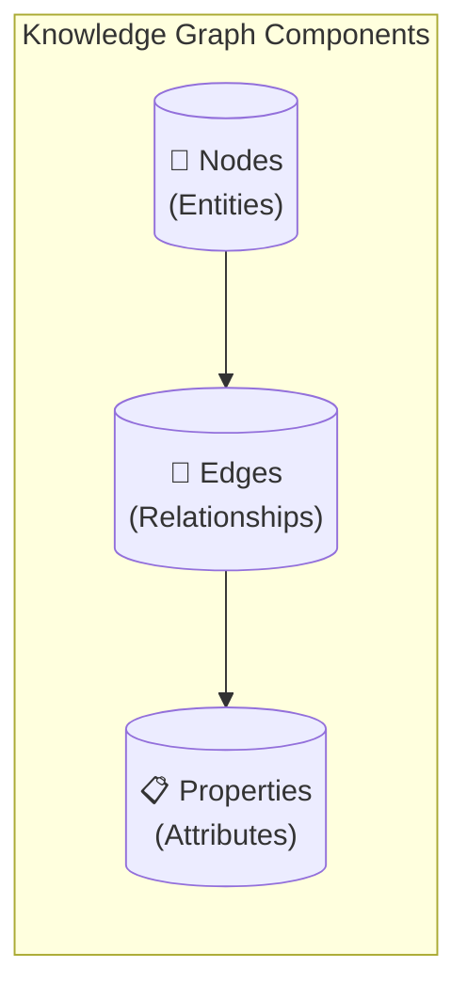

In our context:
- **Nodes** = Tutorials, Topics, Concepts
- **Edges** = "requires", "teaches", "part_of"
- **Properties** = title, author, duration, level

---

## Python 3.4.3 Dependency Graph

Here's a sample dependency graph for the Python 3.4.3 series on Spoken Tutorial:

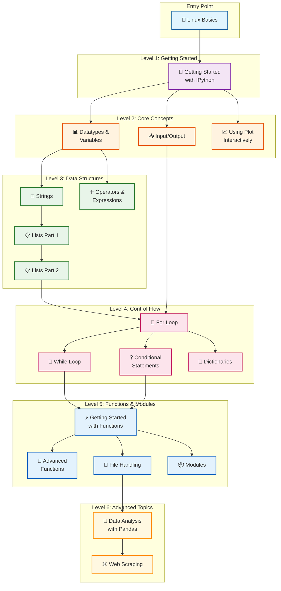

---

## Cross-Topic Dependencies

Tutorials often have dependencies across different FOSS topics:

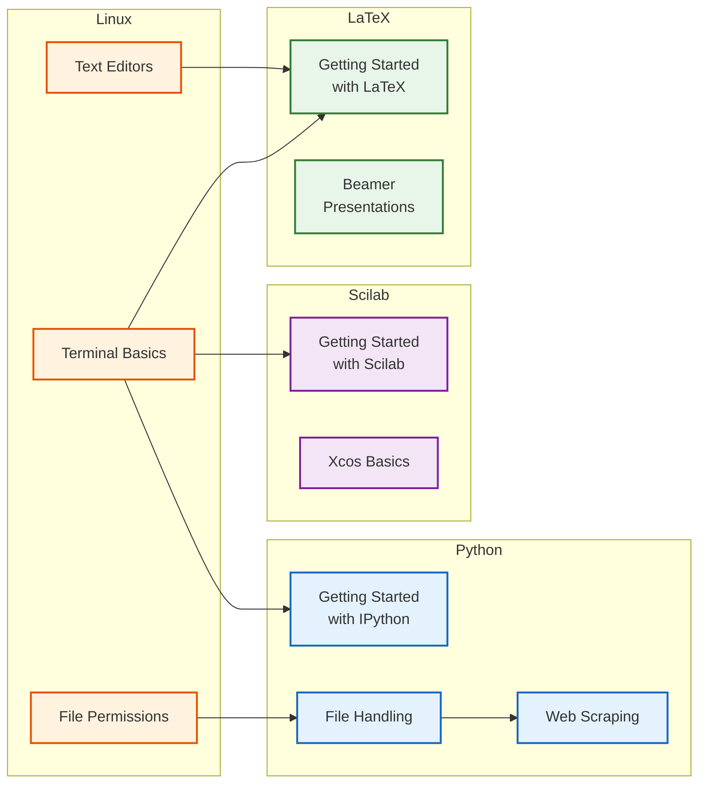

---

## Data Flow Architecture

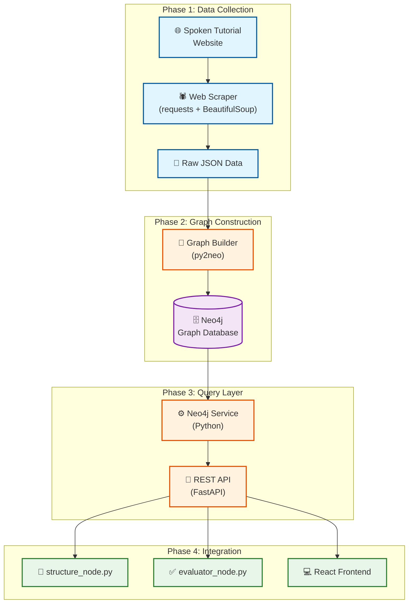

---

## Neo4j Graph Schema

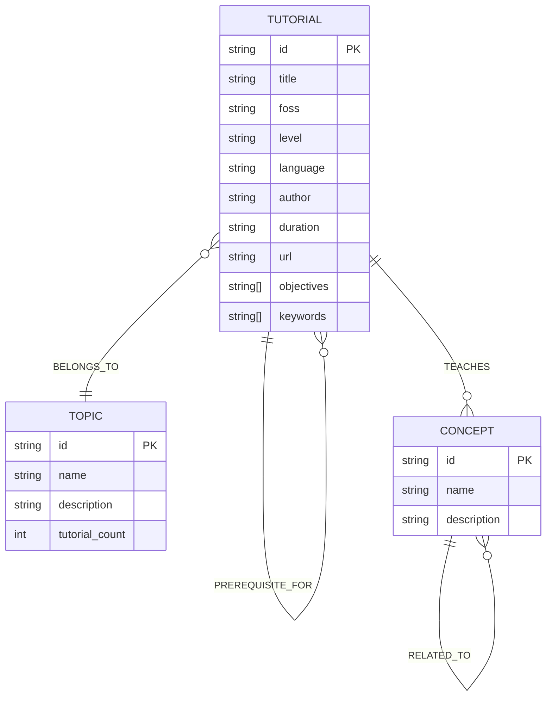

---

## Example Queries

### Query 1: Get All Prerequisites (Recursive)

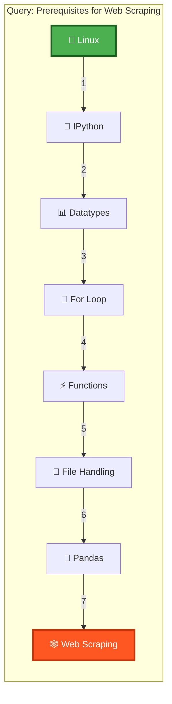

**Result**: `[Linux, IPython, Datatypes, For Loop, Functions, File Handling, Pandas]`

---

### Query 2: What Can I Learn Next?

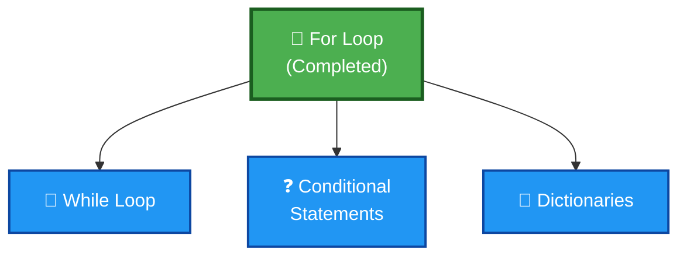

---

### Query 3: Shortest Learning Path

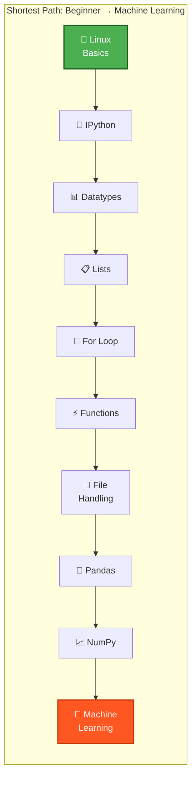

---

## Integration with Slide Generator

### Use Case 1: Auto-populate Prerequisites Slide

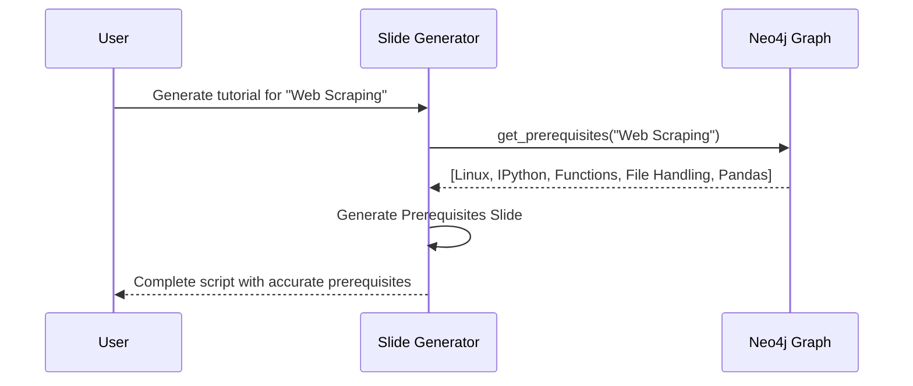

### Use Case 2: Validate Content Consistency

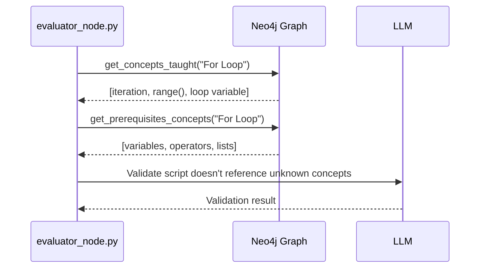

### Use Case 3: Generate "What's Next" Recommendations

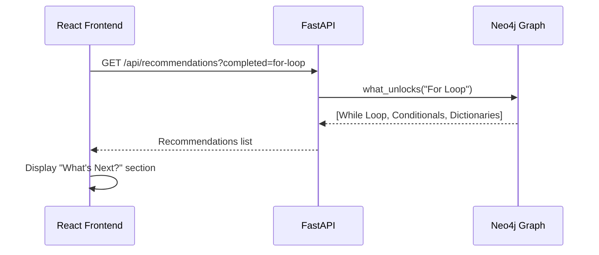

---

## Implementation Plan

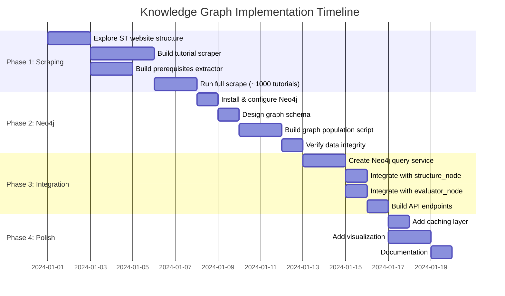

---

## File Structure

```
slide-generator/
├── src/
│   ├── services/
│   │   ├── mediawiki_service.py      # Existing
│   │   ├── spoken_tutorial_scraper.py # NEW: Web scraper
│   │   └── neo4j_service.py           # NEW: Graph queries
│   ├── nodes/
│   │   ├── structure_node.py          # Modified: Use graph for prereqs
│   │   └── evaluator_node.py          # Modified: Validate concepts
│   └── graph/
│       ├── schema.py                  # NEW: Graph schema definitions
│       ├── builder.py                 # NEW: Populate graph from scraped data
│       └── queries.py                 # NEW: Cypher query templates
├── docker-compose.yml                 # Modified: Add Neo4j service
└── docs/
    └── knowledge_graph_walkthrough.md # This file
```

---

## Benefits Summary

| Feature | Without Knowledge Graph | With Knowledge Graph |
|---------|------------------------|---------------------|
| **Prerequisites** | Manual guesswork | Auto-populated, accurate |
| **Learning Paths** | None | Full curriculum generation |
| **Recommendations** | None | Smart "What's Next?" |
| **Validation** | Basic LLM check | Concept-level consistency |
| **Content Gaps** | Unknown | Automatically identified |
| **Cross-topic Links** | Manual | Discovered automatically |

---

## Next Steps

1. **Validate Feasibility**: Scrape a small subset (1 topic, ~20 tutorials)
2. **Proof of Concept**: Build simple graph with NetworkX first
3. **Scale Up**: Migrate to Neo4j and scrape full catalog
4. **Integrate**: Connect to Slide Generator nodes
5. **Visualize**: Add interactive graph visualization to frontend

---

## Questions?

Contact the development team or refer to the [Neo4j Documentation](https://neo4j.com/docs/) for advanced graph queries.
