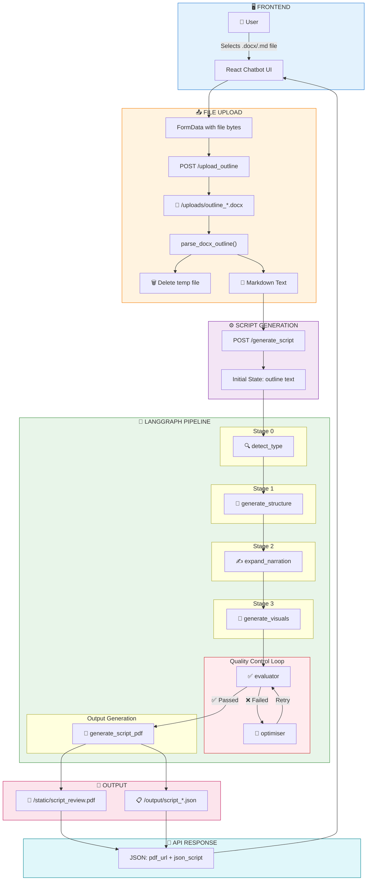

# Script Generation Pipeline

```mermaid
flowchart TB
    subgraph Frontend["🖥️ FRONTEND"]
        direction TB
        U["👤 User"]
        UI["React Chatbot UI"]
        U -->|"Selects .docx/.md file"| UI
    end

    subgraph Upload["📤 FILE UPLOAD"]
        direction TB
        FD["FormData with file bytes"]
        API1["POST /upload_outline"]
        TEMP["📁 /uploads/outline_*.docx"]
        PARSE["parse_docx_outline()"]
        DEL["🗑️ Delete temp file"]
        MD["📝 Markdown Text"]
        
        FD --> API1
        API1 --> TEMP
        TEMP --> PARSE
        PARSE --> DEL
        PARSE --> MD
    end

    subgraph Generation["⚙️ SCRIPT GENERATION"]
        direction TB
        API2["POST /generate_script"]
        STATE["Initial State: outline text"]
    end

    subgraph LangGraph["🧠 LANGGRAPH PIPELINE"]
        direction TB
        
        subgraph Stage0["Stage 0"]
            DT["🔍 detect_type"]
        end
        
        subgraph Stage1["Stage 1"]
            GS["📐 generate_structure"]
        end
        
        subgraph Stage2["Stage 2"]
            EN["✍️ expand_narration"]
        end
        
        subgraph Stage3["Stage 3"]
            GV["🎨 generate_visuals"]
        end
        
        subgraph QualityLoop["Quality Control Loop"]
            EVAL["✅ evaluator"]
            OPT["🔧 optimiser"]
            EVAL -->|"❌ Failed"| OPT
            OPT -->|"Retry"| EVAL
        end
        
        subgraph Output["Output Generation"]
            PDF["📄 generate_script_pdf"]
        end
        
        DT --> GS
        GS --> EN
        EN --> GV
        GV --> EVAL
        EVAL -->|"✅ Passed"| PDF
    end

    subgraph Storage["💾 OUTPUT"]
        direction LR
        SPDF["📑 /static/script_review.pdf"]
        JSON["📋 /output/script_*.json"]
    end

    subgraph Response["📨 API RESPONSE"]
        RES["JSON: pdf_url + json_script"]
    end

    %% Connections between subgraphs
    UI --> FD
    MD --> API2
    API2 --> STATE
    STATE --> DT
    PDF --> SPDF
    PDF --> JSON
    SPDF --> RES
    JSON --> RES
    RES --> UI

    %% Styling
    style Frontend fill:#e3f2fd,stroke:#1976d2
    style Upload fill:#fff3e0,stroke:#f57c00
    style Generation fill:#f3e5f5,stroke:#7b1fa2
    style LangGraph fill:#e8f5e9,stroke:#388e3c
    style QualityLoop fill:#ffebee,stroke:#c62828
    style Storage fill:#fce4ec,stroke:#c2185b
    style Response fill:#e0f7fa,stroke:#00838f
```
