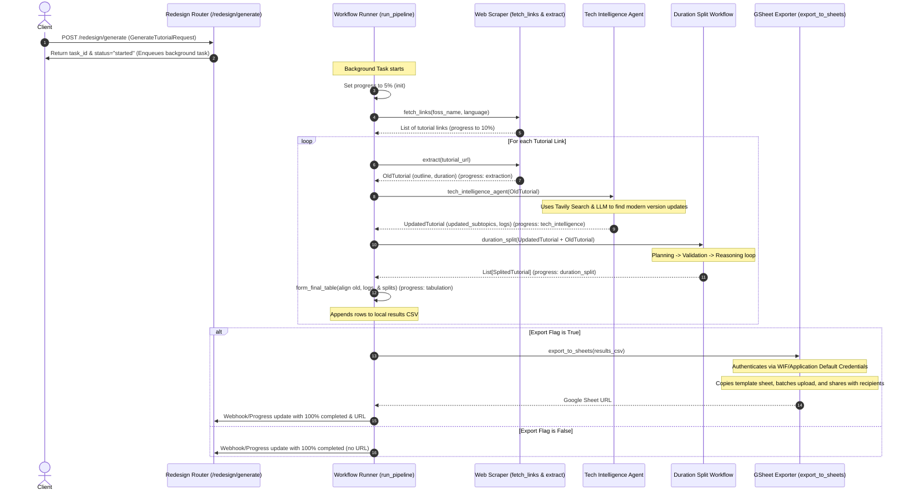
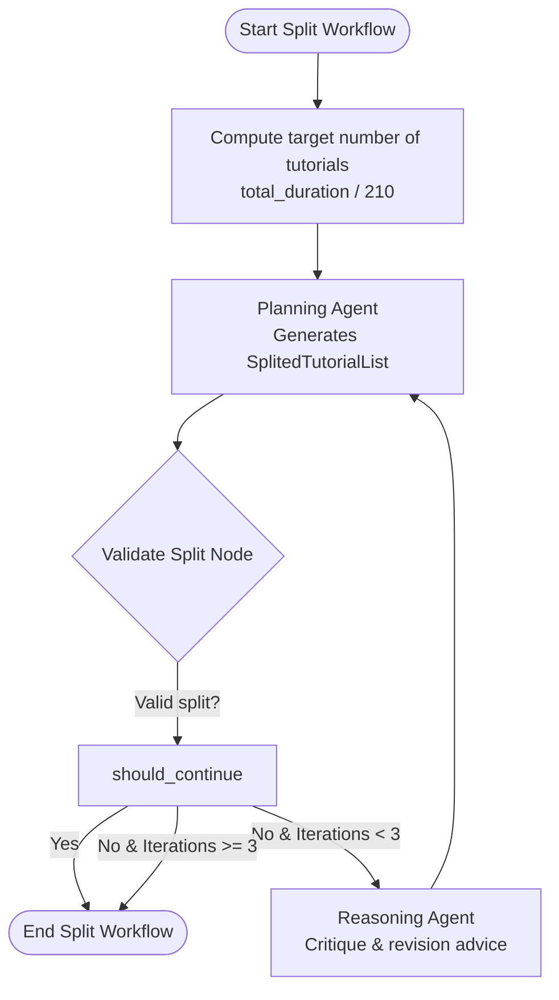

# Tutorial Redesign Module

The **Redesign Module** is an automated pipeline designed to fetch, modernize, validate, and split legacy Spoken Tutorial content. It integrates external scraping, web-search-augmented LLM analysis (Tech Intelligence), a LangGraph-based validation/revision loop for curriculum decomposition, and automated Google Sheets exporting.

---

## Workflow Overview

The entire process begins with an API request to the backend and ends with a formatted Google Sheet containing updated and split tutorials.



---

## Detailed Pipeline Stages

### 1. Request Handling & Initialization
- **Endpoint**: `/redesign/generate`
- **Pydantic Schema**: `GenerateTutorialRequest` contains:
  - `foss_name` (e.g., "Linux AWK")
  - `language` (e.g., "English")
  - `export` (bool)
  - `reciept_emails` (list of recipient emails)
  - `reciept_role` ("writer" | "reader" | "commenter")
  - `webhook_url` (optional callback URL for progress updates)
- **Logic**:
  1. Generates a unique task ID (e.g. `task_a1b2c3d4`).
  2. Sets task progress to `0%` in the in-memory store.
  3. Spawns `run_pipeline` as a FastAPI background task to return a fast response.
  4. Sanitizes the `foss_name` for use in output file naming: `results/{foss_name}_{language}_final.csv`.

### 2. Spoken Tutorial Scraper (`fetch_links` & `extract`)
- **FOSS Search**: Scrapes `https://spoken-tutorial.org/tutorial-search/` using the FOSS name and language.
- **Link Scraping**: Parses the search results via `BeautifulSoup` to find title links matching `/watch/` URLs and builds a list of tutorials.
- **Content Scraping**: For each watch page:
  - Extract outline points from the `<pre class="custom-jumbotron">` block, joining them as a comma-separated string.
  - Extract the video duration from the `<table class="table table-bordered table-hover">` metadata table, converting the formatted time `HH:MM:SS` to a float representing total seconds.

### 3. Tech Intelligence Agent (`tech_intelligence_agent`)
- **Architecture**: A LangGraph React agent using an LLM model and a web search tool.
- **Tool**: `search_long_query` chunks the subtopic list into smaller, optimized search strings and queries Tavily Search API.
- **System Prompt**: `UPDATE_AGENT_PROMPT1` directs the agent to:
  1. Find version changes and modifications for the legacy subtopics.
  2. Maintain a numbered sequence log highlighting changes (new updates/deprecated features).
  3. Return a structured JSON containing `updated_subtopics` and `logs`.

### 4. Duration Split Workflow (`duration_split`)
To fit within modern pedagogical standards, long tutorials (duration > 4 minutes) are split into fragments of **3-4 minutes (180 to 240 seconds)**. This is handled by a LangGraph loop using a **Planning Agent**, a **Validation Node**, and a **Reasoning Agent** (up to 3 iterations).



#### Node Roles:
- **Planning Agent**: Receives subtopics, total duration, and target number of tutorials. It groups related subtopics into fragment titles and assigns durations. If revision is needed, it also receives the previous failed plan, validation errors, and the reasoning agent's critique.
- **Validate Split**: Checks two primary constraints:
  1. Every fragment's estimated duration is between 180 and 240 seconds.
  2. The total number of fragments falls within the expected range `[total_duration / 240 - 1, total_duration / 240 + 1]`.
- **Reasoning Agent**: If validation fails, analyzes the errors, identifies where to merge/split subtopics, and provides actionable revision feedback to the Planning Agent.

### 5. Tabulation (`form_final_table`)
- **Alignment**: Align the original tutorial data (first row only), logs, and split tutorials side-by-side.
- **Schema Mapping**:
  - `Old T#`: Old tutorial index (e.g. `Old T1`)
  - `Old Tutorial Title`: Title of original tutorial
  - `Old Subtopics`: Scraped subtopics
  - `Old Duration`: Scraped duration formatted to `HH:MM:SS`
  - `Logs`: Step-by-step update log from the Tech Intelligence agent
  - `New T#`: New split index (e.g. `New T1`, `New T2`)
  - `New Title`: Title generated for the split fragment
  - `New Subtopics`: Subtopics assigned to the split fragment
  - `New Tutorial Duration`: Split estimated duration formatted to `HH:MM:SS` via `timedelta`
- **Output**: Appends the formatted table rows to the local CSV.

### 6. Google Sheets Export (`export_to_sheets`)
- **Authentications**: Connects to Google Drive & Google Sheets API using Application Default Credentials (ADC) / Workload Identity Federation (WIF) or local gcloud auth.
- **Template Copying**: Copies a pre-configured template spreadsheet defined by `template_id` to a new sheet named `VC-{foss_name}_{language}`.
- **Batch Upload**: Clears rows `A4:Z1000` and writes the tabulated CSV results starting at cell `A3` with the `USER_ENTERED` option.
- **Sharing**: Grants email recipients the requested role (writer, reader, or commenter) and fires notification emails.

---

## Schema Definitions

All structures are modeled using Pydantic:

### Input / Output Payloads
```python
class GenerateTutorialRequest(BaseModel):
    foss_name: str
    language: str
    export: bool = True
    reciept_emails: list[str] = []
    reciept_role: str = "writer"
    webhook_url: str | None = None

class GenerateTutorialResponse(BaseModel):
    status: str
    url: str
    task_id: str | None = None
```

### Shared State Data
```python
class OldTutorial(BaseModel):
    outline: str = None
    duration: float = None

class UpdatedTutorial(BaseModel):
    updated_subtopics: str = None
    logs: list[str] = None

class SplitedTutorial(BaseModel):
    tutorial_title: str
    subtopic: str
    estimated_duration: float

class TutorialState(BaseModel):
    tutorial_name: str
    tutorial_link: str
    old_tutorial: OldTutorial
    updated_tutorial: UpdatedTutorial
    splited_tutorial: list[SplitedTutorial]
```
