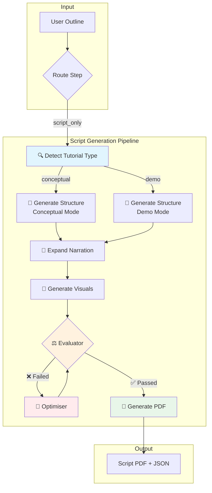

# Script Generation Pipeline

This document describes the workflow for generating Spoken Tutorial scripts.

## Pipeline Overview

## Node Details

### 1. Detect Tutorial Type (`detect_type`)
- **Input**: User outline text
- **Output**: `tutorial_type` ("conceptual" or "demo")
- **Logic**: Uses LLM to classify based on keywords:
  - **Conceptual**: "What is...", "Understanding...", "Explain..."
  - **Demo**: "How to...", "Setting up...", "Create..."

### 2. Generate Structure (`generate_structure`)
- **Input**: Outline + Tutorial Type
- **Output**: `StructuredOutline` with metadata and slide skeleton
- **Conceptual Mode**: Includes analogies, narrative flow
- **Demo Mode**: Action verbs, screen locations, step-by-step

### 3. Expand Narration (`expand_narration`)
- **Input**: Structured Outline + Tutorial Type
- **Output**: `NarrationScript` with full narration per slide
- **Conceptual Mode**: Analogies required, flowing narrative
- **Demo Mode**: Action verbs, one action per sentence, screen-centric

### 4. Generate Visuals (`generate_visuals`)
- **Input**: Narration Script
- **Output**: Image prompts for each slide
- **Logic**: Generates appropriate visual cues based on slide content

### 5. Evaluator (`evaluator`)
- **Input**: Complete JSON Script + Tutorial Type
- **Output**: Pass/Fail + Feedback
- **Conceptual Check**: Narrative flow, analogies, transitions
- **Demo Check**: Action verbs, screen locations, clear steps

### 6. Optimiser (`optimiser`)
- **Input**: Failed Script + Feedback
- **Output**: Improved Script
- **Logic**: Addresses specific evaluation feedback

### 7. Generate PDF (`generate_script_pdf`)
- **Input**: Final JSON Script
- **Output**: PDF file in FOSSEE format

## Tutorial Type Comparison

| Aspect | Conceptual | Demo |
|--------|------------|------|
| **Focus** | Understanding concepts | Performing actions |
| **Analogies** | Required for every topic | Not needed |
| **Narration** | Flowing, narrative | Short, imperative |
| **Examples** | "Think of X like Y..." | "Click the button..." |
| **Screen Locations** | Optional | Required |
| **Evaluation** | Checks narrative flow | Checks action verbs |
